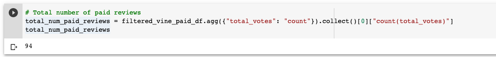
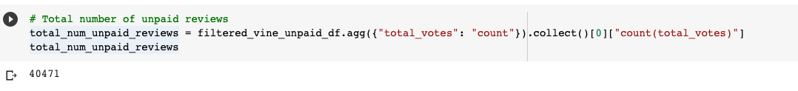
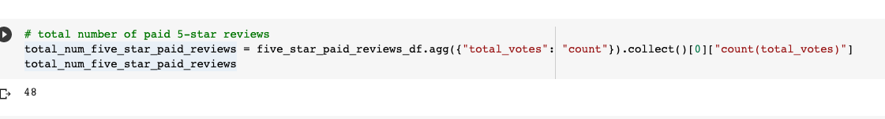
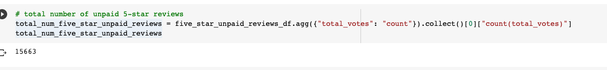
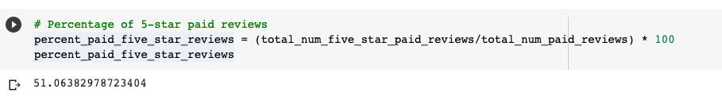
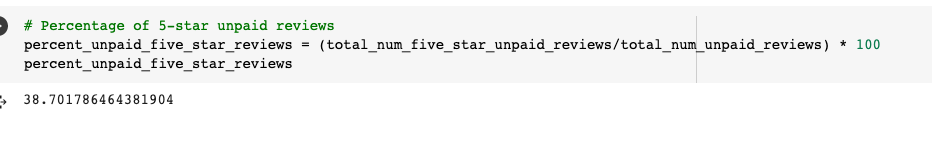

# Amazon_Vine_Analysis

# Overview of the analysis

The main purpose the analysis is to pick a dataset that contains reviews of a specific product, from clothing to wireless products. Use pySpark to perform the ETL process on this dataset to extract, transform the data and load the trasformed data into pgAdmin. Then using pySpark, pandas to determine if there is any bias toward favorable reviews from Vine members in the dataset. Then, provide a summary of the analysis to submit to stake holders.

# Results

## How many Vine reviews and non-Vine reviews were there?

As seen in,  there are 94 vine reviews.

As seen in,  there are 40,471 non-vine reviews.

## How many Vine reviews were 5 stars? How many non-Vine reviews were 5 stars?

As seen in,  48 vine reviews have 5-star rating.

As seen in,  15663 non-vine reviews have 5-star rating. 

## What percentage of Vine reviews were 5 stars? What percentage of non-Vine reviews were 5 stars?

As seen in,  51% of vine reviews were 5 stars.

As seen in, , 38% of non-vine reviewes were 5 stars.

# Summary

As can be seen from the results, the percentage of 5-star reviews by paid memmbers is 51% where as unpaid 5-star review percentage is only 38%. There appears to be some positivity bias for paid reviews in the Vine program.

One additional analysis that can be done with the dataset is to get the percentage of vine vs non-vine reviews that are less than 3-stars.